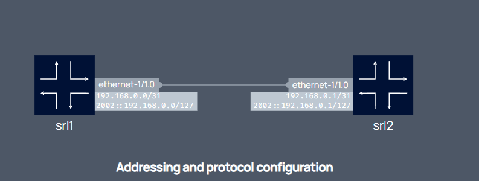

# Lab 2.1 (clab): Two Hosts 

This lab showcase a simple topology of two hosts running Nokia's SR Linux and connected via an ethernet point-to-point virtual link.

Source: [Container Lab examples](https://containerlab.dev/lab-examples/two-srls/).

